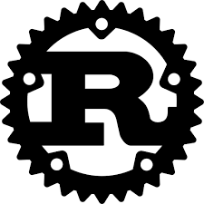

<h1 align="center">Hi there , I'm Łukasz</h1>
 

-  I’m currently learning **ML in Python & Rust**

## 🛠 Languages and Tools

 

             

 

 ## 📊  Github Stats

   
    
   
    

 ## 📞 For Contact
<a href="https://www.thatlukaszguy.dev/contact" target="_blank" rel="noreferrer" alt="link" >Link Here >></a>
You'll be redirected to my Portfolio page at /contact 

 

ps: i like javascript & rust... 🍉

